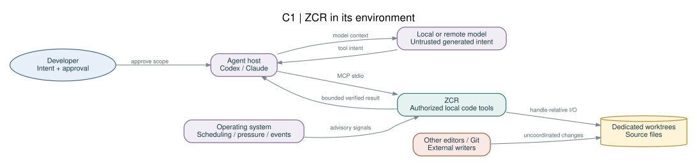
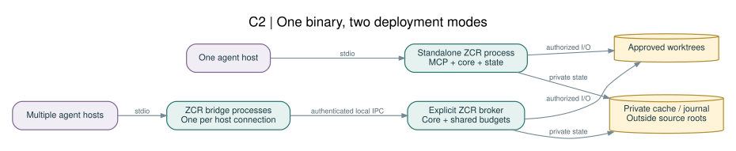
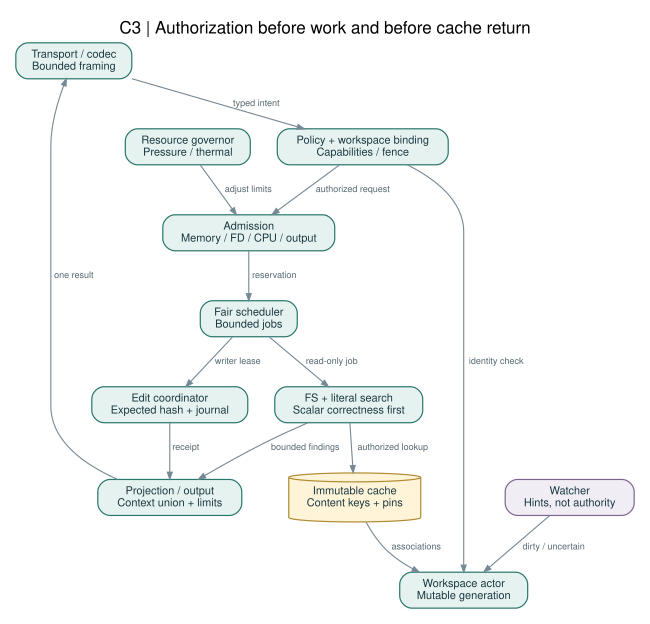
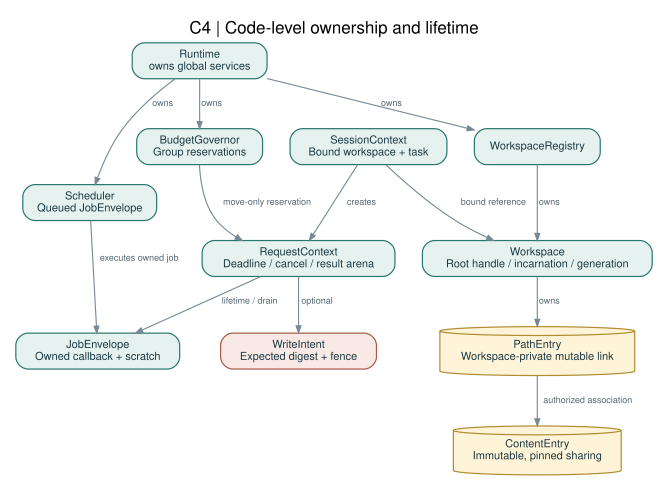
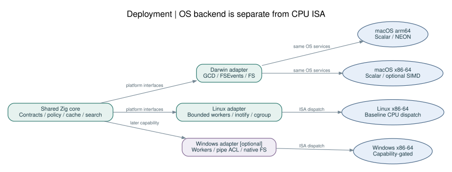

# 03 · C4 아키텍처

C4의 Context·Container·Component·Code 네 수준을 구분한다. 여기서 container는 독립 실행/배포 단위이며 Docker container라는 뜻이 아니다. 도식 표기는 Mermaid/DOT를 사용하지만 관계·책임은 C4 의미를 따른다. [R22](../references/SOURCES.md#R22)

## C1 — System Context

개발자는 coding agent를 통해 작업하고, agent host는 ZCR의 도구를 호출한다. ZCR의 신뢰 경계 밖에는 모델 응답, 레포 콘텐츠, 다른 편집기, 외부 Git 명령이 있다. Git worktree는 코드 저장 위치이며 권한 기관이 아니다. 모델 공급자가 로컬인지 원격인지와 관계없이 도구 데이터 경로는 로컬이다. 원격 모델에 어느 코드가 전달되는지는 host의 사용자 정책으로 통제한다.

| 관계 | 전달 데이터 | 신뢰·동기화 |
|---|---|---|
| Developer→Agent host | 목적·승인 | 사람이 권한을 결정 |
| Agent host→ZCR | MCP tools/call | session capability로 검증 |
| ZCR→Workspace | file handle I/O | root·version·lease 확인 |
| OS→ZCR | QoS, pressure, watcher event | 기능 탐지·fallback |
| External editor→Workspace | 예측 불가능한 변경 | optimistic conflict 검출, 엄격 격리와 구별 |

## C2 — Container

**Standalone:** `zcr mcp` 한 프로세스가 protocol·engine·workspace state를 소유한다. local disk에는 승인된 source와 외부 cache/journal만 있다.

**Managed:** `zcr broker serve`가 state를 보유하고 `zcr mcp --broker`가 stdio↔IPC를 중계한다. binary artifact는 하나이지만 process는 여러 개다. broker와 bridge의 메모리 합계를 비교해야 한다. bridge를 도입했다고 “1개 프로세스”라고 표현하지 않는다.

cache root, journal root, task ledger는 원본 source 디렉터리 밖에 저장한다. broker socket은 사용자 전용 디렉터리 안에 둔다. 별도 root 권한 서비스는 없다.

## C3 — Core Components

입력은 Transport→Policy→Admission→Scheduler를 거친다. 승인 전 cache hit도 반환하지 않는다. 작업별 FS/Search/Edit가 실행되고 Projection에서 문맥을 줄인 뒤 하나의 protocol response로 직렬화한다. Cache와 Watcher는 Workspace Actor를 통해 접근한다. Memory Governor는 모든 컴포넌트의 예약에 영향을 주지만 source 내용을 해석하지 않는다.

컴포넌트 간 동기 호출은 짧은 상태 조회에만 쓴다. 긴 읽기·해시·검색은 actor 외부 job이며 완료 메시지로 state를 갱신한다. 이 구조로 한 worktree의 대형 검색이 다른 worktree의 lease/취소 메시지를 막지 않도록 한다.

## C4 — Code / Ownership Model

`Runtime`은 `BudgetGovernor`, `Scheduler`, `WorkspaceRegistry`를 소유한다. `Workspace`는 root capability와 mutable generation을 가진다. `SessionContext`는 workspace/task에 **바인딩**되며 작업 인자로 권한을 교체하지 않는다. `RequestContext`는 cancellation·deadline·reservation·result arena를 소유한다. worker scratch와 result arena는 lifetime을 분리한다.

`ContentEntry`는 immutable이며 refcount handle로 공유된다. `PathEntry`는 workspace 전용이다. `WriteIntent`는 expected digest와 fence token을 가진다. 선언 수준 타입·서명은 [데이터 모델](17-Data-Model-and-Interfaces.md)이 규범이다.

## Deployment — Apple Silicon / x86

macOS는 GCD/public Darwin FS API, Linux는 bounded worker pool/inotify(제어 연결은 선택적 epoll), Windows 확장은 검증된 native worker/파일 I/O를 adapter 아래에 둔다. CPU 아키텍처별 SIMD와 OS별 scheduler를 한 분기로 섞지 않는다. `macOS-x86_64`도 GCD를 사용할 수 있다.

## Dynamic Diagrams

[검색 파이프라인](../diagrams/search-pipeline.mmd), [편집 상태 기계](../diagrams/edit-state.mmd), [메모리 압력 상태](../diagrams/memory-state.mmd), [구현 DAG](../diagrams/task-dag.mmd)를 함께 제공한다. `.svg`는 오프라인 열람용, `.mmd`와 `.dot`는 변경 가능한 원본이다.

## 구조 검토 체크

각 화살표는 요청 또는 데이터의 방향이다. shared cache는 write 경로가 아니며 broker authority는 OS sandbox와 동등하지 않다. 어떠한 container도 모델에 `run_shell` 권한을 제공하지 않는다. 각 workspace의 쓰기는 그 workspace actor에서 순서를 정하되 파일 I/O를 actor lock 안에서 수행하지 않는다.
