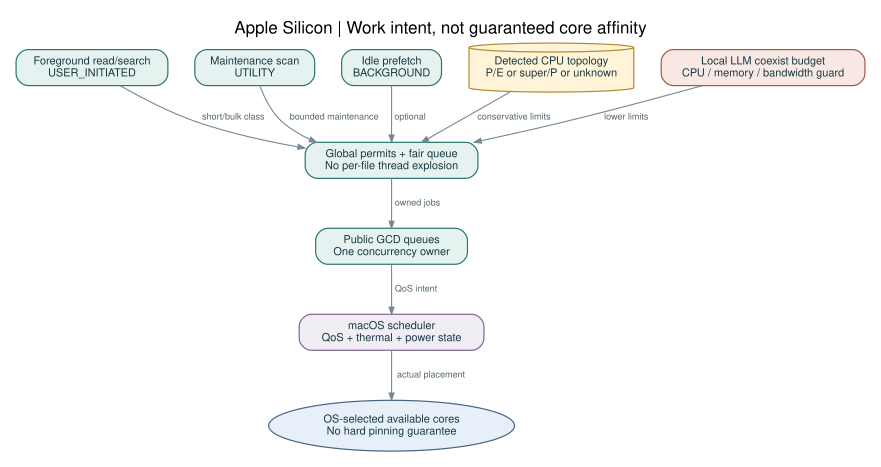

# 04 · Apple Silicon 코어·스레드·에너지 설계

## 1. 코어 용어와 탐지

| 하드웨어 계열의 예 | 문서에서 해석하는 계층 | 설계 규칙 |
|---|---|---|
| 기존 Apple Silicon P/E 구성 | 빠른 코어·효율 코어 | 실제 개수는 런타임 탐지 |
| M5 Pro/Max의 발표된 18코어 구성 | 슈퍼 6·새 성능 코어 12 | 여기에 존재하지 않는 E 4개 등을 더하지 않음 |
| 미확인/새 세대 | 성능 레벨 0..N-1 | 마케팅명 없이 상대 용량 정보로 동작 |
| Intel Mac | physical/logical CPU, 경우에 따라 동일 성능 | Apple Silicon 분기 강제 금지 |

M5 Pro/Max의 슈퍼와 새로운 성능 코어는 Apple이 구분한 실제 명칭이다. 사용자의 “에너지 코어”는 여기서는 efficiency core를 가리키는 표현으로 처리한다. GPU/Neural Engine은 이 CPU 계층의 또 다른 종류가 아니다. ZCR v1은 GPU/ANE를 사용하지 않는다. [R04](../references/SOURCES.md#R04)

프로브는 `hw.ncpu`, `hw.physicalcpu`, `hw.logicalcpu`, 지원되는 경우 `hw.nperflevels` 및 `hw.perflevel{n}.physicalcpu/logicalcpu`를 조회한다. `n=0`이 높은 성능 계층이라는 공개 설명을 활용하되 키 누락·새 계층 수를 허용한다. Monterey 이전 또는 키 조회 실패 시 전체 CPU 수만으로 fallback한다. [R06](../references/SOURCES.md#R06)

**금지:** M4=특정 core index, perflevel1=항상 E, 논리 CPU=물리 CPU, 슈퍼코어는 무조건 P0 같은 하드코딩. 가용 CPU 개수는 launch 시와 전원·설정 변경 후 재평가한다.

## 2. 실제 제어 가능한 것과 불가능한 것

ZCR이 제어하는 것은 **작업 우선순위, 작업량, 동시성, 큐 길이, I/O 수, 캐시 크기**다. 실제 코어 배치는 macOS가 결정한다. QoS가 core 선택과 자원 스케줄링에 영향을 주며, GCD는 OS와 통합된 작업 실행기다. [R05](../references/SOURCES.md#R05)[R06](../references/SOURCES.md#R06)

따라서 다음 표현을 사용한다.

- 슈퍼/빠른 코어 **활용 의도:** 의존성상 즉시 필요한 짧은 foreground 작업에 user-initiated QoS.
- 성능 코어 **활용 의도:** 충분히 큰 독립 chunk를 제한된 수로 병렬 실행하여 처리량 확보.
- 효율 코어 **활용 의도:** 재인덱싱·캐시 정리 등 연기 가능한 작업을 utility/background로 표시.

이는 배치 보장이 아니다. `thread_affinity_policy`를 코어 고정 수단으로 사용하거나 private affinity API로 E/P 코어를 선택하지 않는다. 코어 고정이 필요한 연구 실험은 프로덕션과 분리한다.

## 3. QoS 분류

| 내부 class | 작업 | macOS queue QoS | 실행 조건 |
|---|---|---|---|
| FG_SHORT | read 작은 범위, lease 검증, 상태, 편집 commit 전 검사 | USER_INITIATED | agent가 결과를 기다림 |
| FG_BULK | foreground grep, 그 결과에 필요한 traversal, on-demand parse | USER_INITIATED | chunk로 분할, permit 제한 |
| MAINTENANCE | 사용자 요청한 전체 인덱스 구축·watch 복구 | UTILITY | foreground를 막지 않음 |
| IDLE | speculative prefetch, cache compaction | BACKGROUND | foreground 없음·압력 정상 |

도구 처리에 `USER_INTERACTIVE`를 기본 사용하지 않는다. 실제 UI animation이 아니기 때문이다. foreground search의 필수 traversal를 background에 두면 priority inversion이 생기므로 **의존 작업도 foreground class로 승격**한다. QoS 의미와 우선순위 역전 문제는 Apple 문서를 기준으로 한다. [R07](../references/SOURCES.md#R07)

하나의 queue QoS를 수시 변경하는 대신 고정 QoS queue를 따로 두고 job을 분류한다. 예약된 background job이 foreground 요청의 dependency가 되면 미실행 job을 FG lane으로 이동한다. 이미 진행 중인 chunk는 안전한 지점에서 끝내고 후속 chunk를 승격한다.

## 4. GCD adapter

`dispatch_queue_attr_make_with_qos_class`, `dispatch_queue_create`, `dispatch_async_f`의 C ABI를 사용한다. callback은 Zig의 C calling convention을 쓰고 heap의 JobEnvelope를 context로 전달한다. callback 반환 이전에 envelope를 해제하지 않는다. `_f` variant 사용으로 Blocks ABI와 광범위한 Objective-C 의존을 피한다.

Zig 0.16은 `std.Io`를 도입했고 evented 계열에 Dispatch도 있지만, 그 계열은 실험적이다. 따라서 **Zig Io.Dispatch = 프로덕션 기반**으로 고정하지 않는다. [R02](../references/SOURCES.md#R02)

baseline은 다음 둘을 T00/T09에서 비교한다.

| adapter | 목적 | 중첩 threadpool 방지 |
|---|---|---|
| DarwinGcd + 동기 FS operations | macOS 최적화 기본 후보 | GCD만 outer concurrency 소유 |
| BoundedThreaded + 직접 FS operations | 이식성·차등 baseline | 자체 pool만 outer concurrency 소유 |

job 내부에서 무제한 `Io.concurrent`, `dispatch_apply`, 또 다른 parser pool을 생성하지 않는다. `std.Io`는 명시적으로 주입하되 async orchestration 소유자는 하나다. blocking 디스크 I/O를 GCD worker에서 수행할 경우에도 **submission 전에** I/O permit을 제한하여 thread 폭증을 막는다.

## 5. Permit 모델: 스레드 수가 아니라 허용된 실행량

`N = usable physical CPUs`, `reserve = 2 if N>=8 else 1`, `C_hw=max(1,N-reserve)`.

| 프로파일 | CPU permit 초기값 | CPU permit 상한 | I/O 초기/상한 |
|---|---:|---:|---:|
| latency | min(2,C_hw) | min(4,C_hw) | 2 / 4 |
| balanced (기본) | min(2,C_hw) | min(4,C_hw) | 2 / 4 |
| throughput | min(4,C_hw) | min(8,C_hw) | 4 / 8 |
| local-model-coexist | 1 | min(2,C_hw) | 1 / 2 |
| critical-pressure | 1 | 1 | 1 / 1 |

이것은 OS core의 독점 예약이 아니라 **ZCR의 자발적 상한**이다. GCD가 가진 실제 worker 수는 이 값과 다를 수 있다. 실제 thread 수·peak stack footprint를 telemetry로 기록한다. 동시성은 CPU cap, I/O cap, memory reservation, FD budget의 최솟값을 따른다.

최대 2개의 짧은 foreground 실행 permit을 bulk/maintenance가 모두 점유하지 못하게 한다. 총 cap=1일 때는 예약 없이 chunk 경계에서 foreground를 우선한다. 대기 job이 worker에 들어가 semaphore를 기다리는 구조가 아니라, Admission이 permit을 확보한 job만 GCD에 제출한다.

## 6. 작업 분할과 공정성

초기 chunk는 256 KiB, 매우 작은 파일은 최대 32개 또는 합계 256 KiB 단위로 묶는다. cancellation 검사 및 scheduler 반환 지점은 chunk마다 존재한다. CPU chunk wall time 목표는 2 ms 이하이지만 filesystem syscall 시간은 보장할 수 없다. 너무 짧은 수 마이크로초 job 남발은 금지한다. 작업 pool과 과도한 context switch 방지는 Apple의 공개 지침과 일치한다. [R06](../references/SOURCES.md#R06)

workspace별 동일 기본 가중치, task별 deficit round-robin을 사용한다. foreground:maintenance의 기본 service weight는 4:1이며 idle은 남는 자원만 쓴다. 5초 이상 기다린 maintenance는 utility eligible이 되지만 foreground 응답의 dependency가 아닌 이상 무조건 더 높은 QoS로 바꾸지 않는다. 대기 시간이 길다고 user-interactive로 승격하지 않는다.

예: 4개 worktree가 각 10만 파일을 검색해도 `4 × CPU개수` pool을 만들지 않는다. 하나의 global cap 안에서 각 task의 256 KiB chunk를 교대로 실행한다. 큰 검색 한 건의 throughput 대신 모든 agent의 p95 응답을 최적화한다.

## 7. 전원·열 상태

Low Power Mode·thermal state는 public Foundation API를 읽는 선택적 작은 C ABI shim으로 취득한다. API availability는 실제 deployment target SDK에서 검증하고 미지원이면 unknown으로 둔다. [R10](../references/SOURCES.md#R10)[R11](../references/SOURCES.md#R11)

| 상태 | 정책 |
|---|---|
| AC, 열 정상 | 선택한 profile 유지 |
| 배터리/저전력 | speculative prefetch 중단, maintenance 동시성 1, bulk cap 절반 |
| 열 serious | foreground만 1~2 permit, parsing/background 중단 |
| 열 critical | 새 bulk 요청을 E_BUSY로 돌려보내고 짧은 read/상태/복구만 허용 |
| 메모리 critical | 메모리 문서의 emergency 정책 우선 |

상태 회복은 10초 안정 구간 후 한 단계씩 한다. 1초 미만 주기 busy polling을 사용하지 않는다. 이벤트 기반 감시를 우선하고 sampling은 활성 1초, idle 5초를 초기값으로 한다.

## 8. LLM과의 공존

GPU inference라도 CPU 스캔은 unified memory bandwidth와 page cache를 경쟁할 수 있다는 **설계 위험**을 고려한다. CPU LLM이면 CPU permit 경쟁도 더 크다. 따라서 “E코어에 놓으면 LLM에 영향 없음”을 보장하지 않는다.

host가 제공하는 `model_active`, `model_reserve_mib`, 선택적 `decode_baseline_tok_s`와 현재 tok/s를 사용한다. 모델 프로세스의 메모리를 추측해 자동으로 kill하거나 read하지 않는다. 데이터가 없으면 co-exist profile과 OS pressure만 적용한다. 동일 모델·문맥·출력 조건에서 decode 감소가 5%를 넘으면 background scan을 멈추고 bulk cap을 낮추는 실험적 guard를 둔다. noisy telemetry에서는 5초 window 3회 연속을 요구한다.

## 9. 검증

Instruments의 CPU/System Trace, context switches, queue wait와 실제 core 실행 분포를 확인한다. “코어 고정 성공”이 아니라 QoS 정책에서 end-to-end latency·CPU time·에너지/작업이 개선됐는지를 판정한다. 실제 Mac 실측 전까지 어떤 profile도 최적이라고 명명하지 않는다.
