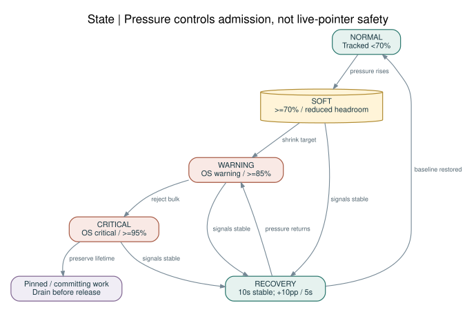

# 05 · 메모리 예산·할당·압력 대응

## 1. 두 종류의 상한을 구별한다

**애플리케이션 예약 상한**은 ZCR이 직접 enforce할 수 있다. **프로세스 RSS/physical footprint 상한**은 allocator 밖의 thread stack·시스템 라이브러리·page cache·mapping에 영향을 받으므로 모니터링·여유분이 필요하다. macOS 일반 프로세스가 자기 RSS를 정확한 byte hard limit로 제한한다고 약속하지 않는다.

broker mode의 `B_group`에는 broker, bridge, optional helper를 포함한다. 로컬 LLM은 다른 제품이므로 group 바깥에 있으나 예산 결정 시 우선 보호한다. `virtual address size`, `RSS`, macOS `physical footprint`, allocator live bytes를 같은 수치로 취급하지 않는다.

## 2. RAM별 초기 기본값

다음은 **기본 상한**이며 시작 시 미리 할당하지 않는다. 사용자 cap이 작으면 그 값을 우선한다. 단위는 MiB다.

| 시스템 RAM | B_group | tracked allocation 상한(75%) | 기본/긴급 | 경로·metadata | 콘텐츠·줄 인덱스 | AST | in-flight |
|---|---:|---:|---:|---:|---:|---:|---:|
| 8 GiB 이하 | 128 | 96 | 16+8 | 24 | 16 | 0 | 32 |
| 16 GiB 이하 | 256 | 192 | 16+8 | 48 | 48 | 16 | 56 |
| 24 GiB 이하 | 384 | 288 | 16+8 | 64 | 80 | 32 | 88 |
| 32 GiB 이하 | 512 | 384 | 24+8 | 80 | 104 | 64 | 104 |
| 64 GiB 이하 (36/48/64 포함) | 768 | 576 | 24+8 | 128 | 144 | 112 | 160 |
| 64 GiB 초과 | 1024 | 768 | 32+16 | 160 | 208 | 160 | 192 |

각 행의 세부 allocation 합은 tracked 상한과 일치한다. 남은 25%는 runtime/stack/bridge/시스템 overhead를 위한 여유다. optional AST를 사용하지 않으면 그 몫을 자동 소진하지 않는다. 큰 RAM이라고 수십 GiB 캐시를 만들지 않는다.

`B_static=min(profile_cap,user_cap)`이다. 명시적인 모델 예산이 있으면 `R_os=max(2 GiB,0.20*R)`를 계획용 여유로 잡고 `B_effective=min(B_static,max(0,R-R_os-R_model_reserved))`로 제한한다. 이 계획값은 현재 모든 다른 앱을 파악한 값이 아니다. 실제 pressure가 최종 조정 신호다. 32 MiB 이하만 남으면 큰 요청을 받지 않고 저자원 오류를 반환한다.

Linux에서는 cgroup memory.max가 유한하면 physical RAM 대신 그 limit도 상한에 반영한다. MemAvailable 같은 관측치에 이미 모델 점유가 포함되어 있다면 같은 모델 메모리를 다시 빼지 않는다. [R19](../references/SOURCES.md#R19)

## 3. 소유권별 allocator

| 수명 | 전략 | 초기값과 제한 |
|---|---|---|
| process/control | budgeted general allocator | 작은 장기 객체만 |
| workspace | slab + offset table | workspace별 quota, mutable 공유 금지 |
| request | request-owned arena | 8 KiB 시작, 반환 후 유지 최대 64 KiB |
| worker/job | 개별 scratch buffer | 256 KiB chunk + 제한된 보조 상태 |
| result | request arena 또는 bounded output buffer | 기본 256 KiB, 최대 2 MiB |
| cache entry | immutable allocation + refcount | eviction 가능, pinned 명시 |
| emergency | 미리 확보한 작은 buffer | 오류/취소/회복에만 사용 |

Zig는 allocator를 명시적으로 전달하고 lifetime 관리는 개발자 책임이다. arena는 요청 단위 반환에 적합하지만 언어가 use-after-free나 data race를 자동 방지하지 않는다. [R03](../references/SOURCES.md#R03)

request마다 전체 파일을 arena에 복사하지 않는다. 내부 source chunk→검색→문맥 추출까지 slice를 사용할 수 있으나, chunk를 재사용하기 전에 필요한 출력만 소유 buffer로 옮긴다. async callback이 끝나기 전에 arena를 reset하지 않는다. task cancel 후 모든 자식 job의 drain이 완료되어야 한다.

## 4. Admission / 예약

수신 프레임은 먼저 16 MiB 한도를 검사한다. decode 전 원문 buffer를 예산에 반영한다. 작업 시작 전에 `input + scratch + output + write_temp + parser_estimate`를 예약하며 실패하면 cache eviction 후 한 번 재시도한다. 다시 실패하면 E_RESOURCE다.

큰 batch는 항목 32개를 동시에 full-buffer로 읽지 않는다. 전체 output cap을 공유하고 실행 항목 수를 남은 예약에 맞춘다. per-task 우선 보장 몫은 `available_inflight / active_tasks`로 시작하고 유휴 몫은 다른 task가 빌릴 수 있지만 강제 회수는 chunk 종료 뒤에만 한다.

quota 집계에서 shared immutable entry는 group에서 한 번만 센다. 각 workspace는 pin/reference 개수를 기록한다. pinned cache 때문에 목표까지 줄일 수 없으면 새 요청을 거부하며, 살아 있는 포인터를 가진 entry를 지우지 않는다.

## 5. 압력 상태 기계

| 상태 | 진입 | 동작 | 회복 |
|---|---|---|---|
| NORMAL | pressure 정상·예약 <70% | 필요 시 제한적 cache 증가 | 유지 |
| SOFT | 예약 ≥70% 또는 footprint 여유 감소 | LRU/probation eviction, prefetch 중단 | 10초 안정 |
| WARNING | OS warning 또는 예약 ≥85% | 목표 예산 절반, bulk·AST admission 축소 | NORMAL로 즉시 점프 금지 |
| CRITICAL | OS critical 또는 예약 ≥95% | unpinned cache 해제, 큰 요청 거부, emergency 경로 | 10초 후 WARNING |
| RECOVERY | 압력 정상화 | 5초마다 cap 10%p씩 회복 | 기본 예산까지 |

표의 예약 비율은 tracked 상한에 대한 비율이다. critical에서 이미 시작한 atomic commit을 중간 파괴하지 않는다. 우선 취소 대상은 speculative 작업, 다음이 bulk scan이고, journal 상태 확인은 끝낼 수 있는 최소 예산을 유지한다.

macOS는 Dispatch memory-pressure 신호와 자체 footprint를 활용한다. 단순 free memory만으로 캐시를 키우지 않는다. Linux는 PSI/cgroup 신호와 allocator 계수를 함께 본다. [R09](../references/SOURCES.md#R09)[R18](../references/SOURCES.md#R18)[R19](../references/SOURCES.md#R19) 시스템 API가 없거나 접근 불가하면 `pressure=unknown`과 보수적 profile을 쓴다.

## 6. 경로·index의 저장 형식

경로는 root-relative UTF-8 byte slab에 저장하고 metadata는 offset/len으로 참조한다. 길이는 u16으로 단정하지 않고 u32를 사용하며 slab은 segment 단위로 나눈다. 파일의 byte offset·size는 u64다. 파일마다 절대경로 복사, DOM 형태 JSON 객체, 전체 line-offset 배열을 상시 보유하지 않는다.

줄 인덱스는 최소 128줄 간격의 sparse checkpoint부터 시작하고 hot file만 조밀하게 만든다. `path_id`는 workspace 내부 식별자이며 전역 콘텐츠 식별자가 아니다. hash map capacity와 tombstone도 메모리 예산에 포함한다.

## 7. 캐시 단계

첫 접근은 probation, 재접근만 protected cache로 승격한다. 한 번의 대형 grep이 interactive hot cache를 쓸어내지 않도록 streaming scan의 read buffer는 content cache에 자동 삽입하지 않는다. AST는 파서·grammar version을 key에 넣고 8 GiB profile에서는 기본 비활성이다.

live working file은 기본 pread/chunked-read다. mmap은 immutable snapshot 또는 자체 검증 cache 파일에만 선택적으로 사용한다. mapping page가 resident가 될 때의 실제 부담과 truncation/SIGBUS 위험을 무시하지 않는다. [R26](../references/SOURCES.md#R26) mmap size threshold는 32 KiB 같은 값을 보편 법칙으로 고정하지 않고 benchmark gate로 정한다.

## 8. 저메모리 예시

8 GiB Mac에서 4개 세션을 broker에 연결했을 때 128 MiB씩 4번 배정하지 않는다. **전체 128 MiB** 안에서 path cache와 request slots를 나눈다. active task는 초기 2개, 나머지는 bounded queue에 대기시킨다. 큰 레포의 모든 경로가 24 MiB metadata 몫에 들어가지 않으면 streaming 탐색으로 내려가고 `index_mode=partial`을 표시한다.

32 GiB 시스템에서도 LLM과 Xcode가 메모리를 많이 사용하면 512 MiB를 고집하지 않는다. warning에서 cache 축소·AST 중단·I/O 동시성 축소를 먼저 적용한다.

## 9. 검증 기준

할당 실패 주입, cancellation 후 live allocation, 10,000회 request 후 안정 구간, 1·4·8 worktree aggregate footprint, capped parser worker, event storm을 시험한다. “arena reset 실행”이 아니라 **reservation이 회수되고 다음 정상 요청이 성공하는 것**이 pass 조건이다. RSS의 즉시 감소는 allocator/OS에 따라 달라 별도 관측치로 기록한다.

## 10. 큰 입력의 admission 예외

API의 8 MiB write/16 MiB raw-frame은 개별 상한이지 모든 RAM profile에서 동시에 보장되는 크기가 아니다. 원문 JSON+decoded replacement+old/new bytes+scratch가 in-flight 몫을 넘으면 큰 요청은 E_RESOURCE로 거부한다. 작은 profile에서 처리하려면 patch 크기/범위를 줄이거나 host가 명시적으로 예산을 재배분해야 하며 emergency reserve를 빌려 쓰지 않는다.

## 11. Zig 0.16 Arena의 실제 의미

Zig 0.16의 ArenaAllocator는 thread-safe·lock-free로 변경됐다. 따라서 shared arena를 피하는 이유는 API가 무조건 thread-unsafe여서가 아니라, 요청별 예산·취소·반납 시점과 객체 lifetime을 명확하게 하기 위해서다. allocator 내부 동시성 지원이 arena 안의 사용자 객체나 살아 있는 slice의 안전한 reset까지 자동 보장하지는 않는다. [R02](../references/SOURCES.md#R02)
