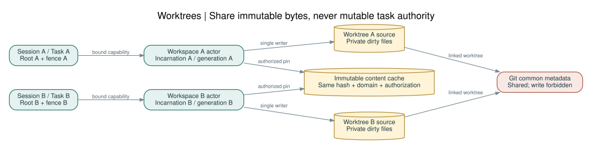

# 06 · Git worktree·동시 task·개발 오염 방지



## 1. 두 격리 문제를 나눈다

**런타임 격리:** ZCR을 사용하는 여러 coding agent가 다른 worktree를 잘못 읽거나 수정하지 않게 한다.

**구현 격리:** ZCR 자체를 개발하는 여러 구현 agent가 서로의 코드를 수정하거나 다른 branch의 테스트를 자기 성과로 보고하지 않게 한다.

Git worktree는 소스 파일/HEAD 등을 분리하지만 일부 refs와 config·object store는 공유한다. worktree를 만든 것만으로 프로세스 보안 sandbox가 생성되지는 않는다. [R16](../references/SOURCES.md#R16)

## 2. 식별자

| ID | 구성·발급 | 금지되는 대체값 |
|---|---|---|
| RepoId | 승인된 git-common-dir의 filesystem identity + registry UUID | 레포 이름만 |
| WorkspaceId | root handle identity + per-worktree git-dir identity + incarnation UUID | HEAD SHA만 |
| TaskId | 운영자/host가 발급한 UUID | 모델이 임의 만든 문자열만 |
| SessionId | handshake 때 생성, task/workspace에 바인딩 | 현재 cwd |
| ContentId | raw bytes SHA-256 | mtime/크기만 |
| PolicyDigest | 승인된 scope·operation·limits의 digest | 레포 안 설정의 최신 내용 |
| FenceToken | writer lease마다 증가하는 epoch | client wall-clock timestamp |

worktree를 삭제 후 같은 경로에 만들면 새로운 incarnation이다. 기존 cursor·cache pointer·lease는 모두 거부한다. branch 이름을 바꾸는 것은 권한 변경이 아니며, checkout으로 파일 내용이 달라지면 generation이 바뀐다.

## 3. Git 발견과 접근

`git -C <approved-root> rev-parse --show-toplevel`, `--absolute-git-dir`, `--git-common-dir`와 `git worktree list --porcelain -z`처럼 명시된 argv를 사용한다. 실제 지원 flag는 T00에서 고정 Git 버전으로 확인한다. process 전체의 `chdir`나 `GIT_DIR` 전역 환경 변경은 사용하지 않는다. [R16](../references/SOURCES.md#R16)

Git 공용 디렉터리가 source root 밖에 있으면 이를 발견했다는 이유만으로 일반 파일 도구의 read 권한을 넓히지 않는다. Git helper의 좁은 metadata 접근과 user-visible source 범위를 별도로 승인한다. linked worktree의 `.git`은 디렉터리가 아닌 파일일 수 있으므로 직접 구조를 추정하지 않는다.

일반 tools는 `.git`과 그 내부에 쓰지 못한다. `worktree add/remove/repair`, `commit`, `update-ref`, `merge`, `reset`은 별도 사람/통합자 작업이다. runtime이 자동 실행하지 않는다. submodule은 자동으로 새 workspace로 신뢰하지 않는다.

## 4. 무엇을 공유하는가

| 데이터 | worktree 간 공유 | 조건 |
|---|---|---|
| 읽은 원본 bytes | 가능 | 동일 SHA-256, 동일 보안 도메인, 재인가 후 반환 |
| line index | 가능 | 같은 bytes와 동일 newline policy |
| AST/outline | 가능 | 같은 bytes·grammar·옵션·버전 |
| path→content 연결 | 불가 | workspace mutable 상태 |
| dirty files·watch cursor·index generation | 불가 | workspace 소유 |
| write lease·task scope·output cursor | 불가 | task/session 소유 |
| semantic dependency index | 기본 불가 | build config·include path 등 context가 다름 |

한 worktree에서 존재하는 파일이 다른 worktree에는 없을 수 있다. shared content hash cache hit는 존재성·경로 권한 검증을 대체하지 못한다. 검색 결과 key에는 workspace, policy digest, ignore digest, query, generation을 포함한다.

## 5. 읽기·쓰기 동시성

읽기는 동일 workspace에서 병렬 허용한다. v1 쓰기는 **workspace당 active writer task 1개**를 기본으로 하고, 한 task 내에서도 단일파일 mutation을 직렬화한다. 여러 agent가 쓰려면 task마다 별도 worktree를 권장한다. future path-disjoint writer mode는 alias·rename·parent-directory 충돌 검증 gate를 통과한 뒤에만 도입한다.

writer lease는 30초 TTL, 10초 갱신의 초기값을 사용한다. lease를 취소할 때는 fence를 올리고 이전 writer의 in-flight job을 drain한다. 이전 writer가 끝나기 전에 새로운 writer에게 commit 권한을 넘기지 않는다. crash/recovery가 불확실하면 workspace를 quarantine한다.

`expected_sha256`와 lease는 참여하는 ZCR client 사이의 충돌 방어다. 외부 editor가 마지막 검사와 rename 사이에 쓰는 것을 일반 POSIX rename만으로 원자적 compare-and-swap처럼 막을 수는 없다. 엄격한 write mode는 **전용 worktree에 쓰는 모든 참여자가 ZCR을 통하도록 운영되는 환경**을 전제로 한다. 이를 보장할 수 없는 shared-editor mode는 기본 read/proposal-only다.

## 6. Scope contract

Task manifest는 `base_commit`, `workspace_id`, `allowed_read_paths`, `allowed_write_paths`, `immutable_paths`, `operations`, `max_changed_files`, `contract_digest`, `fence`, `expires_at`을 가진다. 허용/거부가 겹치면 immutable/deny가 우선한다. scope 변경은 기존 manifest 수정이 아니라 새 policy version 발급이다.

`TaskId`나 `WorkspaceId`를 JSON 인자로 받더라도 transport의 바인딩과 같아야 한다. 다른 task ID를 전달해 권한을 얻지 못한다. 미바인딩 planned manifest는 실행에 사용하지 않으며 E_MANIFEST_UNBOUND다.

## 7. 구현 과정의 오염 방지

각 implementation Task에는 독립 worktree와 branch를 만든다. T01 계약 freeze 후 module ownership을 정한다. `build.zig`, 공통 타입, wire schema, global policy는 **통합자만 수정**하며 다른 task는 ADR/change request를 남긴다.

실행 순서는 다음과 같다.

```text
claim task → record base/contract hashes → preflight scope
→ write failing test → RED evidence → implementation
→ GREEN evidence → diff/untracked audit → review → commit
→ isolated integration worktree에서 병합 → 전체 테스트
```

preflight는 tracked diff뿐 아니라 untracked·삭제·rename·symlink를 검사한다. `git diff --name-only`만 쓰면 untracked를 놓칠 수 있으므로 `git status --porcelain=v2 -z`와 `git ls-files --others --exclude-standard -z`의 출력을 함께 처리한다. path는 NUL 구분으로 파싱한다.

각 task의 빌드 산출물·TMPDIR·test fixture·로그는 `$STATE/tasks/<TaskId>/...`에 둔다. `.zig-cache`, `zig-out`을 다른 task와 mutable 공유하지 않는다. read-only compiler package cache는 toolchain digest가 같을 때만 공유하고 전역 cache purge를 금지한다.

## 8. Step handoff

Step마다 `task_id`, `step_id`, `base_commit`, `head_commit`, `working_tree_digest`, `contract_digest`, `owned_paths`, `tests_run`, `exit_codes`, `remaining_risks`를 남긴다. 새 agent는 이 기록과 실제 worktree 상태가 같을 때만 이어서 작업한다. 컨텍스트에 다른 프로젝트가 등장해도 해당 task의 scope를 넓히지 않는다.

테스트 결과에는 실행 binary digest와 source commit을 같이 적는다. 옆 worktree에서 만들어진 바이너리로 통과한 결과를 자신의 증거로 사용할 수 없다. 테스트·문서만 수정해 실패를 숨기는 변경은 승인된 목표 수정 ADR 없이는 금지한다.

## 9. 통합 게이트

integrator는 artifact provenance, allowed paths, contract compatibility, negative/security tests, performance regression을 확인한다. 충돌 해결 과정은 별도 integration step으로 기록한다. 기본 branch에 직접 병렬 편집하지 않는다. 사용자가 가진 기존 수정은 stash/reset으로 정리하지 않고 task claim을 실패시켜 보존한다.

## 10. 프로세스 재시작 경계

broker 재시작 시 이전 in-memory lease는 모두 폐기한다. capability에는 broker boot nonce를 포함하고 새 세션에서 재인증한다. persist된 generation/fence를 재사용하더라도 과거 boot의 token으로 commit할 수 없다. 실제 root identity가 바뀌면 workspace incarnation도 새로 만든다.
