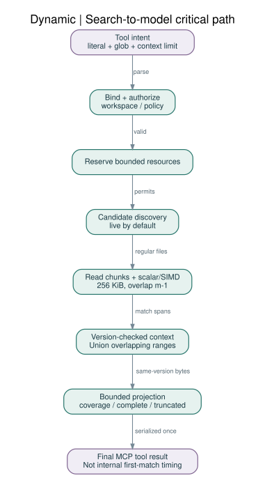
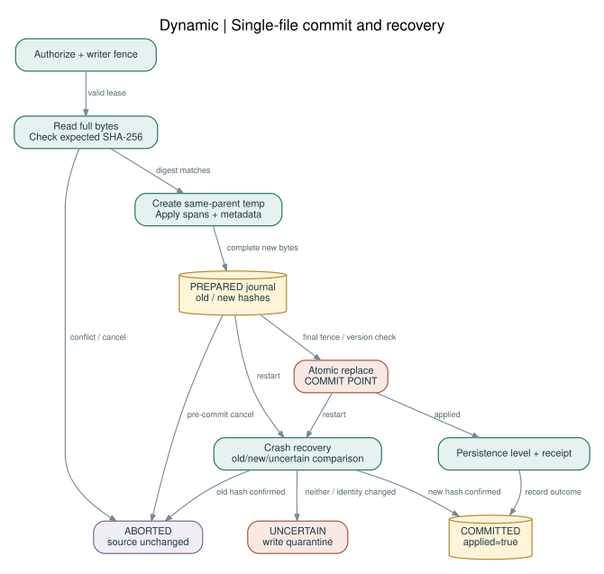

# 07 · 실행 파이프라인과 현재성 계약

## 1. 공통 pipeline

```text
receive bounded frame
→ protocol decode
→ session/workspace/task authorization
→ deadline + resource reservation
→ query plan + consistency selection
→ fair scheduler
→ safe file handles / cache revalidation
→ scan/read/prepare mutation
→ context projection + bounded output
→ response + telemetry + reservation release
```

인증·인가 전에는 cache도 조회 결과를 반환하지 않는다. 소스 콘텐츠는 실행 지시가 아니라 untrusted data다. 큐가 가득 차면 `E_BUSY`와 재시도 가능 여부를 반환하며 무한 대기하지 않는다.

## 2. read pipeline

`zcr_read`는 root-relative path, line start/count, optional `write_intent`를 받는다. 작은 line read는 파일 전체를 decode해서 AST를 만들지 않는다. 승인된 root handle에서 경로를 resolve하고 open/fstat, 필요한 byte 범위를 읽고 content를 반환한다.

sparse line index가 없으면 필요한 지점까지 순차 scan한다. 파일 끝의 200줄을 처음 읽는 비용을 O(200줄)이라고 부르지 않는다. `write_intent=true`는 최대 8 MiB 파일의 전체 bytes를 hash하여 writable snapshot digest를 만들므로 일반 read보다 비쌀 수 있다. 동일 bytes에 대한 검증 가능한 trusted generation cache가 있으면 hash를 재사용할 수 있다.

read 결과는 `path`, `workspace_id`, `generation`, `line_range`, `byte_range`, `version_kind`, `sha256?`, `consistency`, `truncated`, `coverage`를 가진다. CRLF는 원본 byte offset으로 계산한다.

## 3. 검색 + 문맥 pipeline



명시적 literal query는 regex parser를 거치지 않는다. file filter/ignore로 후보를 줄이고, byte scan 중 매치를 찾고, 같은 파일의 겹치는 문맥을 합쳐 반환한다. `search`를 했는데 위치만 받아 다시 10회 read하는 경로를 줄이는 것이 핵심이다.

초기 context는 앞뒤 2줄이고 호출자는 0~20줄을 선택한다. 기본 100 matches/256 KiB 상한에 도달하면 `truncated=true`, `complete=false`, 이유를 명시한다. 매치를 발견할 때마다 stdout을 임의 출력하지 않는다. MCP의 최종 tool result까지 모델이 부분 결과를 소비할 수 있다고 가정하지 않는다. [R14](../references/SOURCES.md#R14)[R15](../references/SOURCES.md#R15)

첫 page를 빠르게 반환하는 것과 전체 검색 결과가 빨리 완성되는 것을 분리한다. `time_to_first_internal_match`는 내부 지표이고 `tool_result_delivered`와 같지 않다. strict benchmark에서는 complete 결과/동일 출력으로 비교한다.

## 4. Batch pipeline

`zcr_batch_read` 한 번에 최대 32항목을 받지만 concurrency는 resource budget이 결정한다. 동일 `(workspace,path,range,version)` 요청을 deduplicate하고 겹치는 범위를 병합한다. 응답은 입력 순서와 item id를 유지한다. 한 파일이 없으면 그 항목만 오류며 다른 항목의 성공을 숨기지 않는다.

batch 전체 output cap을 넘는 항목은 `E_OUTPUT_BUDGET`로 표시하거나 명시적인 continuation을 제공한다. 서로 다른 workspace 항목을 하나의 session-bound batch에 섞지 않는다. v1 batch는 read-only이며 patch/create를 섞은 transactional batch는 없다.

## 5. 편집 pipeline



```text
authorize write + lease/fence
→ safe open + full raw-byte digest
→ expected hash / task scope / metadata check
→ apply non-overlapping byte spans in memory (file <=8 MiB)
→ create temp in same directory, preserve supported metadata
→ journal PREPARED (required durability)
→ final version/fence check
→ atomic single-file replace       [commit point]
→ directory/file persistence step if requested
→ inspect resulting version
→ journal COMMITTED
→ invalidate workspace generation and return receipt
```

원본의 줄 번호를 다시 추정해 조용히 맞춰 적용하지 않는다. byte span은 original snapshot 기준이며 겹침·역순·UTF-8 중간 분할을 거부한다. digest mismatch는 `E_VERSION_CONFLICT`다. multi-file edit은 여러 single-file receipt를 가진 plan일 뿐 all-or-nothing이 아니다.

## 6. 현재성 수준

| consistency | 의미 | 허용되는 최적화 |
|---|---|---|
| checked_live (기본) | 이번 요청에서 열린 파일의 메타데이터를 읽기 전후 확인 | 파일별 현재성 확인, global snapshot 보장 아님 |
| managed_generation | 모든 참여 writer가 ZCR을 통해 변경하는 전용 worktree의 generation | 내부 변경 epoch로 mutable 연결 cache 활용 |
| bounded_stale (명시적) | 마지막 검증 시점의 경로/index 사용 | 최대 age와 누락 가능성 표시 |
| immutable_snapshot | content-addressed 또는 지정 Git object의 고정 bytes | 안전한 공유 cache/mmap 가능 |

`mtime+size` 동일은 암호학적 동일성을 보장하지 않는다. checked_live는 외부 동시 변경을 완벽히 감지하는 snapshot isolation이 아니다. 엄밀한 byte snapshot이 필요한 편집에는 digest와 전용 writer policy를 함께 사용한다.

기본 `zcr_files`와 `zcr_search`의 후보 나열은 checked_live일 때 현재 filesystem traversal를 한다. watcher 경로 index만 사용하여 새 파일을 누락하면서 complete=true로 보고하지 않는다. managed_generation 또는 명시적 bounded_stale에서만 cached glob fast path를 허용한다.

## 7. Watch pipeline

감시 시작→초기 scan→scan 중 이벤트 reconcile→generation publish 순서를 사용한다. event callback은 dirty path를 bounded queue에 적는 것만 하고 파일 전체 parse를 하지 않는다. coalescing은 작업량을 줄이는 힌트이며 dropped/root-changed/event-id-wrap은 필요한 범위 rescan을 유발한다. [R08](../references/SOURCES.md#R08)

유실된 workspace는 `index_state=uncertain`으로 바뀌며 최신성을 보장하는 검색은 live traversal로 fallback한다. rescan이 완료되기 전에 이전 generation을 새 것처럼 발행하지 않는다. event 폭풍에서 dirty queue가 가득 차면 항목을 버리고 정상이라고 처리하지 않고 workspace 전체 dirty로 승격한다.

## 8. 모델 전체 loop

```text
model plans
→ search(with context) 또는 batch_read
→ 제한된 정확한 context만 model에 전달
→ model emits patch intent
→ version-checked single-file edit
→ host-owned build/test tools
→ 결과 확인 / 필요 시 좁은 재탐색
```

빌드·테스트 실행은 기존 host가 담당하며 ZCR에는 arbitrary exec를 넣지 않는다. 모델이 읽기 결과를 기다리는 동안 ZCR은 명시적으로 요청된 독립 read만 미리 수행한다. future write를 추측해서 source를 수정하지 않는다.

## 9. backpressure와 cancellation

read/search는 chunk마다 취소 상태와 deadline을 검사한다. result writer가 막히면 새 producer job submission을 중단한다. global bounded queue와 client backlog 한도를 동시에 적용한다. 한 느린 client가 모든 session을 막지 않도록 writer queue를 session별로 분리한다.

MCP stdio는 newline-delimited JSON-RPC이며 하나의 message 안의 개행은 escape되어야 한다. 로그는 stderr로만 쓴다. 여러 worker가 같은 stdout에 레코드를 interleave하지 않는다. [R14](../references/SOURCES.md#R14)

커밋 전에 취소하면 source는 바뀌지 않는다. 커밋 후 취소는 `applied=true, cancellation_observed=true`인 receipt 또는 복구 조회로 결과를 확인한다. 취소 응답이 왔다고 source가 무조건 미변경이라고 해석하지 않는다.
