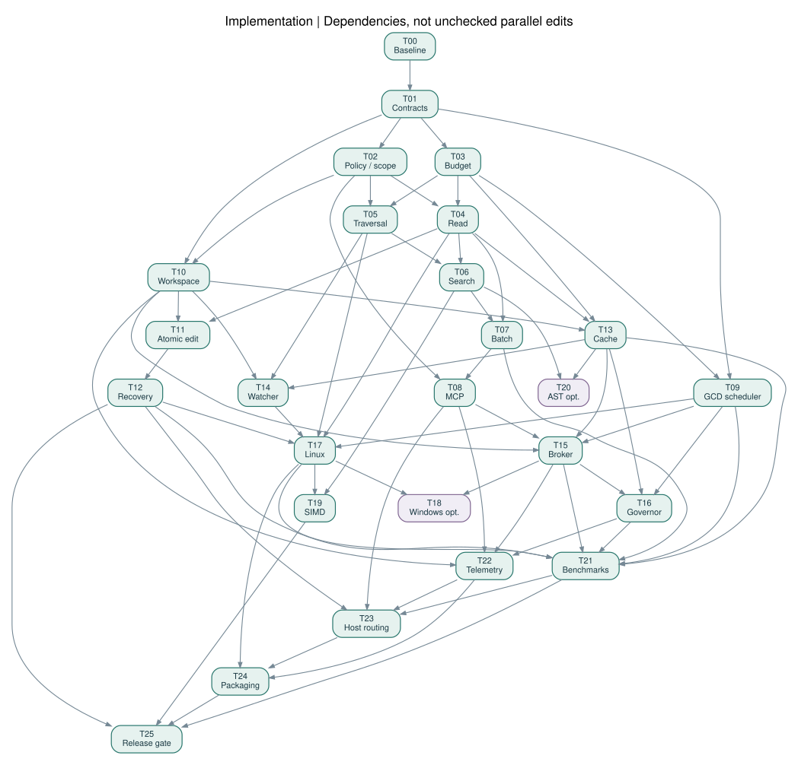

# 구현 Task 인덱스

**26 Tasks · 각 Task S01–S06.** 현재 상태는 [progress.json](progress.json), 실행 순서는 [후속 계획](../docs/superpowers/plans/2026-09-12-runtime-continuation.md)을 따른다. T00–T07에는 구현과 과거 증거가 있으며, 새 통합 소스의 재검증과 남은 플랫폼 게이트를 구분한다. 독립 branch/worktree, owned files, dependencies, inputs/outputs, RED/GREEN test, provenance handoff를 기준으로 진행한다. 단순 순서가 아니라 아래 DAG를 따른다.

| Task | 목적 | 선행 Task | 구분 |
|---|---|---|---|
| [T00](T00.md) | 측정 기준선과 플랫폼 spike | — | 필수 |
| [T01](T01.md) | 계약·build runner·개발 scope 기준선 | T00 | 필수 |
| [T02](T02.md) | Capability·경로·개발 소유권 guard | T01 | 필수 |
| [T03](T03.md) | 예산 allocator와 admission | T01 | 필수 |
| [T04](T04.md) | 정확하고 제한된 범위 Read | T02, T03 | 필수 |
| [T05](T05.md) | Git-aware 탐색과 ignore | T02, T03 | 필수 |
| [T06](T06.md) | Scalar literal 검색과 문맥 투영 | T04, T05 | 필수 |
| [T07](T07.md) | Batch read와 공통 output projection | T04, T06 | 필수 |
| [T08](T08.md) | Direct stdio MCP adapter | T02, T07 | 필수 |
| [T09](T09.md) | Bounded scheduler와 Darwin GCD | T03, T01 | 필수 |
| [T10](T10.md) | Workspace identity와 writer lease | T02, T01 | 필수 |
| [T11](T11.md) | 단일파일 atomic patch/create | T04, T10 | 필수 |
| [T12](T12.md) | Journal·crash recovery·idempotency | T11 | 필수 |
| [T13](T13.md) | Immutable content·line cache | T04, T10, T03 | 필수 |
| [T14](T14.md) | Watcher invalidation와 live fallback | T05, T10, T13 | 필수 |
| [T15](T15.md) | 명시적 broker와 다중세션 budget | T08, T09, T10, T13 | 필수 |
| [T16](T16.md) | Pressure·thermal·LLM 공존 governor | T09, T13, T15 | 필수 |
| [T17](T17.md) | Linux x86-64 backend | T04, T05, T09, T12, T14 | 필수 |
| [T18](T18.md) | Windows 확장 — 선택 | T17, T15 | 선택 |
| [T19](T19.md) | ARM64/x86 SIMD 선택 가속 | T06, T17 | 필수 |
| [T20](T20.md) | Tree-sitter outline — 선택 | T13, T06 | 선택 |
| [T21](T21.md) | 재현 가능한 전체 벤치마크 하네스 | T07, T09, T12, T13, T15, T16, T17 | 필수 |
| [T22](T22.md) | Bounded telemetry와 health | T08, T10, T15, T16 | 필수 |
| [T23](T23.md) | Codex/Claude 실제 라우팅 검증 | T08, T12, T21, T22 | 필수 |
| [T24](T24.md) | 패키징과 실제 지원 행렬 | T17, T22, T23 | 필수 |
| [T25](T25.md) | 최종 통합·격리·성능 release gate | T24, T21, T19, T12 | 필수 |

구현은 이 저장소에서 Task별 독립 worktree로 진행한다. schema와 runner 변경은 단일 integration owner가 처리한다.
